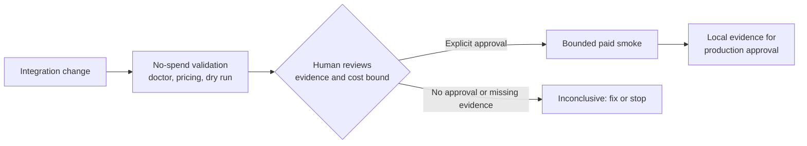

# LLM Preflight

<!-- mcp-name: io.github.feronovak/llm-preflight -->

**Last reviewed:** 2026-09-08 · **As of:** v2.12.0

[](https://pypi.org/project/llm-preflight/)
[](https://github.com/feronovak/llm-preflight/actions/workflows/tests.yml)
[](LICENSE)


Catch LLM integration regressions before they ship. LLM Preflight is a local
contract preflight for model, prompt, structured-output, and provider-call
changes. It runs a small cross-provider preflight and compares validated output,
response speed, tokens, and estimated cost.

## Try it in 60 seconds

Create and run a deterministic local benchmark—no API key or network request:

```bash
python3 -m pip install llm-preflight
llm-preflight init
llm-preflight benchmark.json --no-save
```

From a source checkout:

```bash
python3 -m llm_preflight init
python3 -m llm_preflight benchmark.json --no-save
```

`init` never overwrites an existing config. It creates a mock benchmark so
you can see the report and exit behavior before making a paid request.
Its result is intentionally `inconclusive` (exit code `3`): a local mock
validates configuration and output handling, but cannot approve a live model.

## Choose your path

- **Validate a change.** Compare an approved model, prompt, schema, or provider
  route with a candidate using the [model-change guide](https://github.com/feronovak/llm-preflight/blob/main/docs/guides/model-change.md).
- **Review a new model.** Discover metadata, deliberately probe a route, then
  prepare a bounded candidate smoke with the [model-catalogue guide](https://github.com/feronovak/llm-preflight/blob/main/docs/guides/model-catalog.md).
- **Automate an established contract.** Add the no-spend
  [GitHub Marketplace Action](https://github.com/feronovak/llm-preflight/blob/main/docs/automation/github-action.md)
  or use [CI and JSON output](https://github.com/feronovak/llm-preflight/blob/main/docs/automation/ci.md).
- **Configure a coding agent.** Start the local MCP server from a trusted
  repository with `llm-preflight-mcp --workspace "$PWD"`, then use the
  [MCP server guide](https://github.com/feronovak/llm-preflight/blob/main/docs/automation/mcp.md)
  for your client configuration.

## Safety boundary



LLM Preflight is local evidence, not production approval. It is not a hosted
evaluation platform, tracing system, RAG framework, or public leaderboard.
Its results apply to your account, network, prompts, and validation rules.

> [!WARNING]
> Live benchmarks make paid API requests. Start with the no-key demo, preview
> the plan before a live run, and keep limits and repetitions small.

## CLI, CI, and MCP

Works as a CLI, GitHub Action, and local MCP server. Every path starts with
no-spend validation and planning; a live provider run remains an explicit,
bounded human-approved step. See the [GitHub Action guide](https://github.com/feronovak/llm-preflight/blob/main/docs/automation/github-action.md)
or the [MCP server guide](https://github.com/feronovak/llm-preflight/blob/main/docs/automation/mcp.md).

For earlier releases, see the [changelog](CHANGELOG.md).

## Purpose

**Mission:** help engineers catch LLM integration regressions before shipping a
change.

**Vision:** every LLM-related pull request carries reproducible evidence of
compatibility, latency, and cost.

**Positioning:** LLM Preflight is a local CLI and CI tool that checks an
application's LLM contract and reports compatibility, latency, and estimated
cost before a change ships.

It is built for small engineering teams maintaining AI features. Coding agents
can run the same checks, while engineers own the decision. Read the [north
star](https://github.com/feronovak/llm-preflight/blob/main/docs/NORTH_STAR.md)
and the [AI implementation testing guide](https://github.com/feronovak/llm-preflight/blob/main/docs/automation/agent-validation.md)
for the intended workflow and boundaries.

## Common jobs

- **Switch a model or provider.** Run the bounded
  [migration check](#change-a-model-safely), then add the contract test your
  feature needs.
- **Check a prompt, schema, parser, or tool change.** Define an explicit
  [output contract](https://github.com/feronovak/llm-preflight/blob/main/docs/guides/output-contracts.md)
  before the smoke, then run `llm-preflight benchmark.json --contract-check`
  to prove local accepted/rejected fixtures and lint declared tool schemas.
- **Plan an agent-made change.** Run `llm-preflight benchmark.json --change-plan`
  before the ordinary no-spend checks. It identifies static model and contract
  signals in local Git changes, but never authorizes a paid run.
- **Review a newly discovered model.** Refresh metadata, then prepare—not run—
  a bounded candidate plan:

  ```bash
  llm-preflight catalog refresh benchmarks/watch.json
  llm-preflight catalog prepare benchmarks/watch.json \
    --against benchmarks/approved.json --output benchmarks/candidates.json
  llm-preflight benchmarks/candidates.json --migration-check --dry-run
  ```

  Only explicitly approved, fully evidenced models proceed to paid work; see
  the [model catalogue guide](https://github.com/feronovak/llm-preflight/blob/main/docs/guides/model-catalog.md).
- **Investigate a provider or price change.** Run `--doctor`,
  `--pricing-check`, and a dry-run; report a suspected regression through the
  redacted issue forms.
- **Automate a known contract.** Use the no-spend GitHub Action or the
  [CI guide](https://github.com/feronovak/llm-preflight/blob/main/docs/automation/ci.md)
  with a saved baseline and `--ci`.

It measures deterministic test validity, end-to-end latency (p50/p95), time to
first token, throughput when the stream is incremental and usage is available,
token totals, and estimated cost. Result files retain request metadata and per-request observations for
reproducibility.

"Deterministic" describes the validator, not the model: every response is
checked against explicit structural rules — a regular expression, a JSON shape,
an exact routing label — so the same response always produces the same verdict.
The tool does not score semantic quality; that is your task-specific
evaluation, and it stays out of scope on purpose.

## What live evidence looks like

A completed preflight retains per-request observations and a machine-readable
decision: contract validity, latency (including TTFT where observable), token
usage, estimated cost, pricing evidence, and blocking warnings. The terminal
summary is a convenience; automation should consume the saved JSON decision.

That evidence applies to your account, network, prompts, and validator at one
time—not a universal model ranking. For a complete interactive example, see
[interactive runs](https://github.com/feronovak/llm-preflight/blob/main/docs/guides/interactive-runs.md).

## First live run

Python 3.10+ is required. There are no third-party runtime dependencies:
`pip install llm-preflight` installs this package and nothing else, and the
CLI runs on the Python standard library alone. Development tools (pytest,
ruff, mypy) are optional extras that never reach a production install.

```bash
cp benchmark.example.json benchmark.json
cp .env.example .env.production
# Edit benchmark.json and add only the provider keys you use.
python3 -m llm_preflight benchmark.json --dry-run
python3 -m llm_preflight benchmark.json
```

The CLI reads `.env.production` beside the config without overriding environment
variables already set by your shell. Use `--no-env-file` or `--env-file PATH`
when needed. Runs print a terminal report and, unless `--no-save` is used,
write JSON and Markdown results under `results/`.

Install the command globally in a virtual environment if preferred:

```bash
python3 -m pip install llm-preflight
llm-preflight --init
```

Run `--doctor` and `--dry-run` before the final command. They make no generation
requests; the final command is the paid work.

## Change a model safely

This is the core workflow. Put your approved model and candidate model in one
config, then run the small response-and-contract preflight:

```bash
llm-preflight benchmark.json --migration-check --dry-run
llm-preflight benchmark.json --migration-check
```

It sends three short representative cases to each selected model, once each.
It answers: did the API work, did each response meet the basic contract, and
how quickly did the provider start and finish responding? It is a cheap
compatibility check, not a statistical performance conclusion.

When that passes, run the task-specific checks that match your application—for
example `exact-routing-check` or `structured-output-check`—before approving a
switch.
Use [custom contract tests](https://github.com/feronovak/llm-preflight/blob/main/docs/guides/output-contracts.md) to express the outputs your
own feature must preserve.

## Using a coding agent

Give an agent the same evidence you would use yourself: a reviewed config, an
explicit output contract, and a dry run before paid work. Start with the
recommended five-check suite:

```bash
# No generation request: inspect credentials, model selection, and paid-work plan.
llm-preflight benchmark.json --doctor --json
llm-preflight benchmark.json --tests agent-smoke --smoke --dry-run --json

# Paid run, only after reviewing the plan.
llm-preflight benchmark.json --tests agent-smoke --smoke --json --no-save
```

An agent should not infer model IDs, weaken a validator to turn a failure into
a pass, or approve a model without an explicit instruction. The compact
[LLM and coding-agent guide](https://github.com/feronovak/llm-preflight/blob/main/docs/automation/coding-agents.md)
covers commands, result JSON, exit codes, and automation guardrails. The
[AI implementation testing guide](https://github.com/feronovak/llm-preflight/blob/main/docs/automation/agent-validation.md)
shows how to make this validation an agent's default testing step.

## MCP for coding agents

Use the local stdio MCP server when an agent needs the preflight evidence
without shell parsing or arbitrary command execution:

```json
{
  "mcpServers": {
    "llm-preflight": {
      "command": "llm-preflight-mcp",
      "args": ["--workspace", "/absolute/path/to/repository"]
    }
  }
}
```

It exposes only four tools: validate a config, prepare a dry-run plan, run an
explicitly confirmed preflight, and compare saved baselines. The first, second,
and fourth tools never contact providers or load credentials. A live run still
needs an explicit paid-run confirmation. See the [MCP server guide](https://github.com/feronovak/llm-preflight/blob/main/docs/automation/mcp.md) for tool
semantics, workspace boundaries, and the safe agent workflow.

## Useful commands once you know your path

```bash
# Inspect configuration, credentials, and model selection without generation.
# --doctor provides pricing advisory; use --pricing-check as the fail-closed coverage gate.
llm-preflight benchmark.json --doctor
llm-preflight benchmark.json --pricing-check
llm-preflight benchmark.json --dry-run

# Run a reduced live benchmark.
llm-preflight benchmark.json --smoke

# Run a single ad hoc prompt.
llm-preflight --quick "Return only valid JSON with a status field." \
  --models openai:gpt-5.4-mini
```

For advanced discovery, interactive runs, CI, baselines, replay, and stop
modes, see [workflows](https://github.com/feronovak/llm-preflight/blob/main/docs/guides/model-change.md). For models, environment files,
custom prompts, and provider-specific options, see
[configuration](https://github.com/feronovak/llm-preflight/blob/main/docs/reference/configuration.md).

## What makes a comparison useful

- Keep prompts, system instructions, temperature, and output limits fixed.
- Validate outputs: a fast malformed response is a failed result.
- Run from the same host; network distance and provider load affect latency.
- Treat single-user latency and load testing as separate experiments.
- Prefer dated model IDs over moving aliases.

The CLI distinguishes `API FAIL` (transport, credentials, provider, or request
failure) from `API OK / TEST FAIL` (a response that fails your validator).
Recommendations only consider models that pass every selected test.

## How it compares

Several good tools live near this space. Use them when their job is your job:

- **promptfoo, deepeval** — full evaluation suites: scored quality metrics,
  red-teaming, large ongoing test matrices in CI. Use them to grade prompt and
  model quality over time.
- **Braintrust, LangSmith** — hosted platforms: tracing, dashboards, team
  collaboration, production observability.
- **`llm` (Simon Willison)** — a general multi-provider CLI for running
  prompts, not a comparison harness.

LLM Preflight does one narrower job: the local go/no-go check in the moment
before an LLM integration change. Your prompt, candidate models, structural
validation, latency, and cost — one command, one report, no hosted service, no
telemetry, and no vendor between you and the verdict.

## Documentation

Start at the [documentation homepage](https://github.com/feronovak/llm-preflight/blob/main/docs/index.md), then choose the path that matches your work:

- **Start safely:** [safe demo](https://github.com/feronovak/llm-preflight/blob/main/docs/getting-started/safe-demo.md) and
  [model change](https://github.com/feronovak/llm-preflight/blob/main/docs/guides/model-change.md).
- **Validate a change:** [output contracts](https://github.com/feronovak/llm-preflight/blob/main/docs/guides/output-contracts.md),
  [model catalogue](https://github.com/feronovak/llm-preflight/blob/main/docs/guides/model-catalog.md), and
  [pricing and safety](https://github.com/feronovak/llm-preflight/blob/main/docs/guides/pricing-and-safety.md).
- **Automate:** [CI and JSON output](https://github.com/feronovak/llm-preflight/blob/main/docs/automation/ci.md),
  [coding agents](https://github.com/feronovak/llm-preflight/blob/main/docs/automation/coding-agents.md), and
  [MCP](https://github.com/feronovak/llm-preflight/blob/main/docs/automation/mcp.md).
- **Look up details:** [CLI reference](https://github.com/feronovak/llm-preflight/blob/main/docs/reference/cli.md),
  [configuration](https://github.com/feronovak/llm-preflight/blob/main/docs/reference/configuration.md),
  [result JSON](https://github.com/feronovak/llm-preflight/blob/main/docs/reference/results.md), and
  [troubleshooting](https://github.com/feronovak/llm-preflight/blob/main/docs/operations/troubleshooting.md).
- **Understand the product:** [north star](https://github.com/feronovak/llm-preflight/blob/main/docs/NORTH_STAR.md),
  [product decisions](https://github.com/feronovak/llm-preflight/blob/main/docs/DECISIONS.md), and
  [AI implementation testing](https://github.com/feronovak/llm-preflight/blob/main/docs/automation/agent-validation.md).
- [Contributing](https://github.com/feronovak/llm-preflight/blob/main/CONTRIBUTING.md) — development setup and the TDD workflow.
- [Security](https://github.com/feronovak/llm-preflight/blob/main/SECURITY.md) — reporting vulnerabilities.

## Contributing and license

Contributions are welcome; see [CONTRIBUTING.md](https://github.com/feronovak/llm-preflight/blob/main/CONTRIBUTING.md). Released
under the [MIT License](https://github.com/feronovak/llm-preflight/blob/main/LICENSE).
