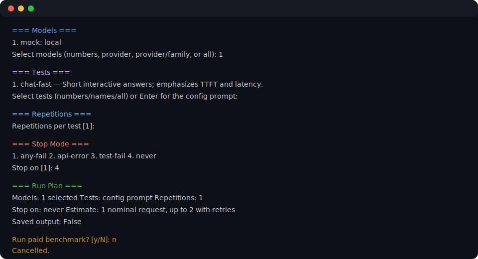

# Interactive mode

Run `llm-bench benchmark.json --interactive` to select the work at the terminal
instead of passing selectors on the command line. The session has three stages:

1. **Select** models, tests, repetitions, and stop mode.
2. **Preview** the paid work: request count, retry-expanded maximum, estimated
   cost, retention mode, and test breakdown.
3. **Run** only after confirming `y`; live progress distinguishes API and test
   status for every request.

This is a real session from the no-key mock config created by `llm-bench --init`.
It was cancelled at confirmation, so it made no network or paid request.

Select models by number, provider, provider/family, or `all`. Select tests by
number, name, or `all`; pressing Enter uses the config's top-level prompt.
Choose `never` in the interactive menu to run every selected model. On the
command line, achieve the same behavior by omitting `--stop-on`.

Interactive mode cannot be combined with `--catalog`, `--tests`, `--profiles`,
or `--prompt`. Use [CLI reference](cli-reference.md) for all combinations.
